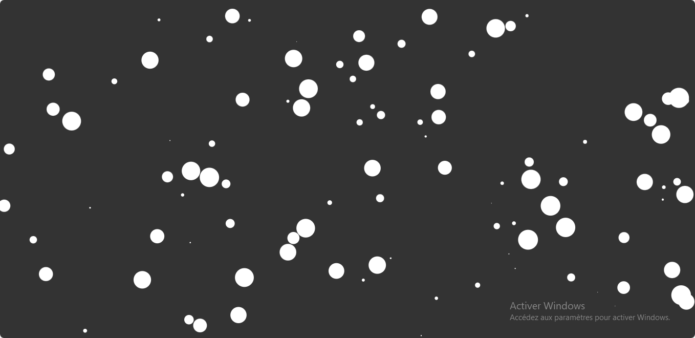

# ✨ Floating Particles with Canvas

A simple visual effect created with the HTML Canvas API. This project displays floating particles with random sizes and smooth animations.

## ✨ Features

- ⚪ Random particle generation  
- 📏 Each particle has a random size and position  
- 🧭 Continuous animation of floating movement  

## 🛠️ Tech Stack

- HTML (Canvas)  
- CSS  
- JavaScript

## 📸 Preview

## 🎓 Learning Source
This project was built while following a course on Udemy as part of a training to practice handling cookies in JavaScript.

## 🚀 Getting Started

- Live Site - [Particles](https://particles-gilt.vercel.app/)

## 👨‍💻 Author

### Grace Ariane
Frontend developer passionate about creative coding tools ✨
- linkedIn - [Grace Ariane Tchoukeu](https://www.linkedin.com/in/grace-ariane-tchoukeu)